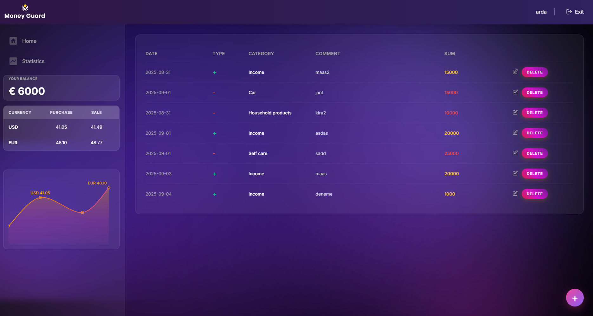
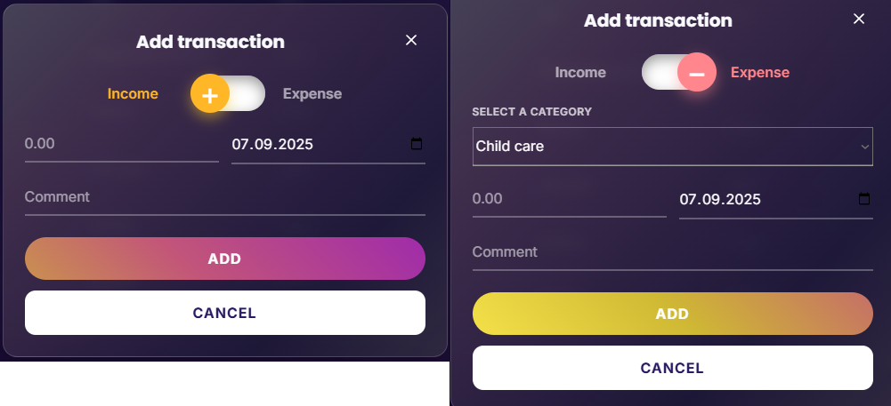
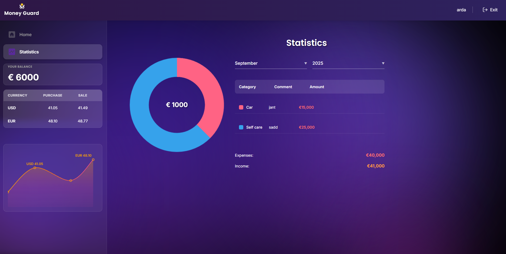

# 💰 Money Guard

[](https://money-guard-z41y.vercel.app/login)\
[](https://github.com/goit-react-group-a/money-guard)

**Money Guard**, kişisel finanslarını kolayca yönetmeni sağlayan modern
ve kullanıcı dostu bir uygulamadır. Gelirlerini ve giderlerini takip et,
kategorilere ayır, grafiklerle analiz et ve bütçeni daha iyi planla! 📊



------------------------------------------------------------------------

## ✨ Özellikler

-   💸 **Gelir & Gider Takibi** -- Tüm işlemlerini kolayca kaydet\
-   📊 **Dinamik Grafikler** -- Kategori bazlı harcama analizi\
-   🔍 **Filtreleme & Arama** -- Tarihe, kategoriye göre işlemleri
    görüntüle\
-   📱 **Responsive Tasarım** -- Mobil, tablet ve masaüstü uyumlu\
-   🌍 **Çoklu Para Birimi** -- Monobank API üzerinden güncel kurlarla
    işlem yap\
-   🎨 **Modern UI** -- Blur efektleri ve şık arayüz

------------------------------------------------------------------------

## 🚀 Canlı Uygulama

👉 [Projeyi Görüntüle](https://money-guard-z41y.vercel.app/login)

------------------------------------------------------------------------

## 🖼️ Ekran Görüntüleri

### 🏠 Dashboard


### 📑 Transactions



### 📈 Statistics



------------------------------------------------------------------------

## 🛠️ Kullanılan Teknolojiler

-   **React**, **Redux Toolkit**, **React Router**\
-   **Monobank API** (döviz kurları ve banka entegrasyonu)\
-   **CSS Modules**\
-   **Chart.js / Recharts** (grafikler için)\
-   **Vercel** (deployment)

------------------------------------------------------------------------

## 🙋‍♂️ Katkı Sağla

1.  Forkla 🍴\
2.  Yeni bir branch oluştur (`git checkout -b feature/yenilik`)\
3.  Değişiklik yap & commit et\
4.  Branch'i pushla (`git push origin feature/yenilik`)\
5.  Pull request oluştur

------------------------------------------------------------------------
> 💡 Money Guard ile finansal özgürlüğünü planla! 🚀


---

## 🚀 Deployment (GitHub Pages)

1. Repository Settings → Pages: **Deploy from GitHub Actions** veya `gh-pages` branch.
2. Projede: `npm install` ardından:
   ```bash
   npm run build
   npm run deploy
   ```
3. Gerekirse Vite base yolunu .env üzerinden ayarlayın:
   ```env
   VITE_BASE_PATH=/goit-react-project-money-guard/
   ```

## 🔐 Environment

`.env.template` dosyasını `.env` olarak kopyalayıp değerleri doldurun:
```env
VITE_API_URL=https://your-backend.example.com
VITE_APP_NAME=Money Guard
VITE_BASE_PATH=/
```

## 🧪 PageSpeed İpuçları
- Font preconnect/Display swap kullanıldı.
- Görseller optimize edildi, büyük görsellere `loading="lazy"` ekleyin.
- Production build ile ölçüm yapın: `npm run build && npx serve dist`

